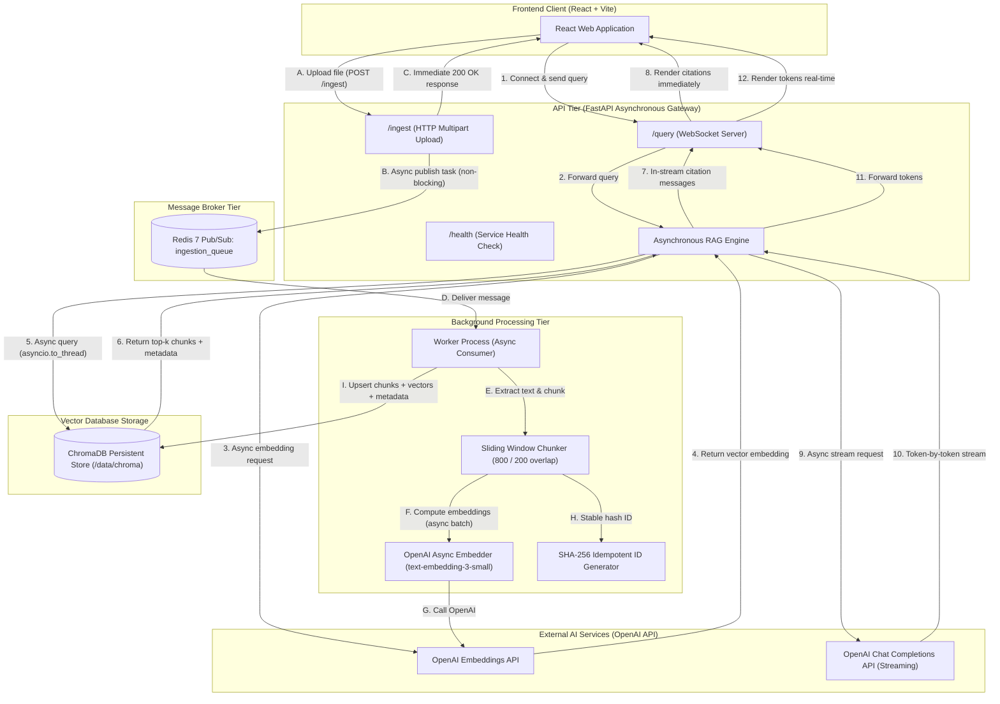
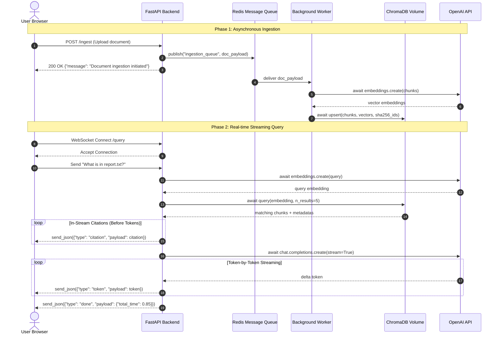

# System Architecture & Technical Design

## 1. System Overview

The **Real-Time Streaming RAG Application** is a decoupled, asynchronous, production-grade AI system designed for low-latency question answering with continuous, non-blocking document ingestion.

The architecture strictly decouples the user-facing API and streaming engine from the heavy document processing pipeline using an asynchronous message queue.



---

## 2. Component Breakdown

### 2.1 Backend API Server (`backend/app/main.py`)
- **Framework**: FastAPI running on Uvicorn with `asyncio`.
- **Endpoints**:
  - `GET /health`: Returns service health status and actively verifies Redis connectivity (`redis.ping()`).
  - `POST /ingest`: Receives document files asynchronously, extracts raw text, and publishes a JSON task to the `ingestion_queue` Redis channel using non-blocking `await redis_client.publish(...)`.
  - `WS /query`: Bidirectional WebSocket endpoint handling real-time query streams.
- **Connection Management & Disconnect Safety**:
  - Implements targeted exception handling for `fastapi.websockets.WebSocketDisconnect`.
  - Cleans up client socket resources upon abrupt disconnects to prevent dangling connections and unhandled server-side exceptions.

### 2.2 Asynchronous RAG Pipeline (`backend/app/rag.py`)
- **Non-blocking Execution**:
  - Query embeddings are generated using `openai.AsyncOpenAI`.
  - ChromaDB similarity queries are wrapped in `asyncio.to_thread()` to prevent database file locks from freezing the asyncio event loop.
- **In-Stream Citation Delivery**:
  - As soon as the vector store returns the top matching documents and their relevance metadata, discrete citation events are pushed to the client via `await websocket.send_json({"type": "citation", "payload": ...})` **prior** to the generation and streaming of LLM answer tokens.
- **Token Streaming**:
  - Uses `gpt-4o-mini` with `stream=True`.
  - Each token is streamed to the client as:
    ```json
    {"type": "token", "payload": "token_string"}
    ```
  - Upon completion, a completion frame is transmitted:
    ```json
    {"type": "done", "payload": {"total_time": 1.24}}
    ```

### 2.3 Vector Database Layer (`backend/app/vectorstore.py`)
- **Storage Engine**: ChromaDB persistent client mounted to a shared volume (`/data/chroma`).
- **Stable Hashing & Idempotency**:
  - Replaced unstable Python `hash()` with cryptographically stable `hashlib.sha256(chunk.encode("utf-8")).hexdigest()`.
  - Uses `collection.upsert()` rather than `collection.add()`, guaranteeing that re-ingesting duplicate documents or re-processing redelivered messages never introduces duplicates.
- **Thread Pool Delegation**:
  - `add_documents()` and `query_documents()` both delegate ChromaDB's underlying synchronous C/SQLite calls to worker threads via `asyncio.to_thread()`, keeping the main event loop responsive.

### 2.4 Background Ingestion Worker (`backend/worker/worker.py`)
- **Isolation**: Runs as an independent process in a dedicated Docker container (`streaming-rag-worker`).
- **Message Consumption**: Subscribes to the `ingestion_queue` channel via `redis.asyncio` pub/sub.
- **Chunking Strategy**: Configured with a sliding window of 800 characters and 200 characters overlap (`chunk_overlap=200`), preserving semantic context across chunk boundaries.
- **Batch Embedding**: Converts chunks into vector embeddings via `openai_client.embeddings.create` in a single non-blocking async batch call.
- **Fault Tolerance**: Automatic reconnection loops with exponential backoff if Redis or OpenAI network errors occur.

### 2.5 Frontend Client (`frontend/src/App.jsx`)
- **Framework**: React 19 bootstrapped with Vite.
- **Real-Time Rendering**:
  - Progressive token accumulation in state without UI freezing.
  - Separate structured rendering of source citations, metadata (relevance score, source filename, chunk index), and streaming status.
  - Auto-scrolling response console for seamless reading experience.
- **File Upload Interface**:
  - Async multipart file upload to `/ingest` with visual upload feedback.

---

## 3. Communication Protocol

All WebSocket frames on `/query` use structured JSON payloads:

| Message Type | Direction | Payload Example | Description |
| :--- | :--- | :--- | :--- |
| `query` | Client → Server | Plain text (e.g., `"What is RAG?"`) | User query text |
| `citation` | Server → Client | `{"source": "report.txt", "page": 0, "snippet": "...", "relevance_score": 0.92}` | Dispatched immediately upon retrieval before token generation |
| `token` | Server → Client | `"Retrieval"` | Single LLM response token |
| `done` | Server → Client | `{"total_time": 1.18}` | Stream completed flag with total latency |
| `error` | Server → Client | `"OpenAI service rate limit exceeded"` | Propagated runtime exception |

---

## 4. Scalability & Production Readiness



- **Horizontal Worker Scaling**: Workers can be scaled (`docker-compose up --scale worker=3`) by transitioning from Pub/Sub to Redis Consumer Groups (`XREADGROUP`) without touching API code.
- **Shared Storage**: ChromaDB is decoupled and backed by a Docker volume (`chroma-data`), ensuring persistence across container lifecycle events.
- **Zero Crosstalk**: Each WebSocket session maintains an isolated coroutine loop with independent memory context.